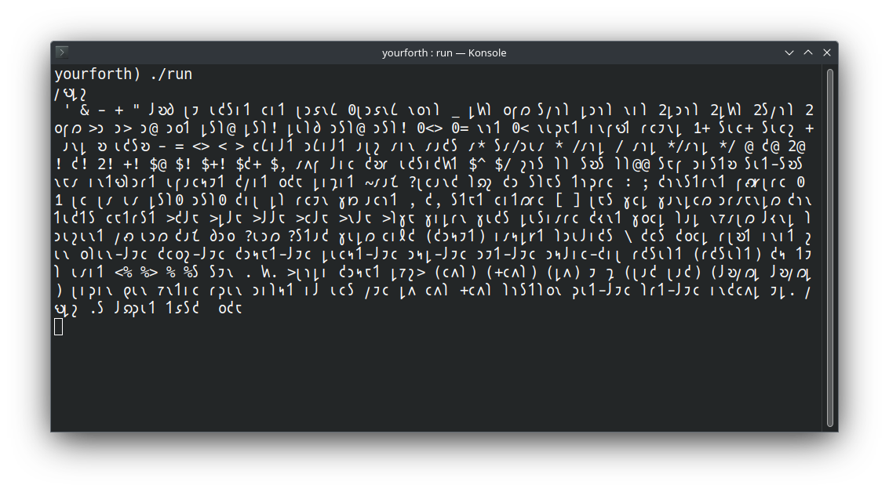
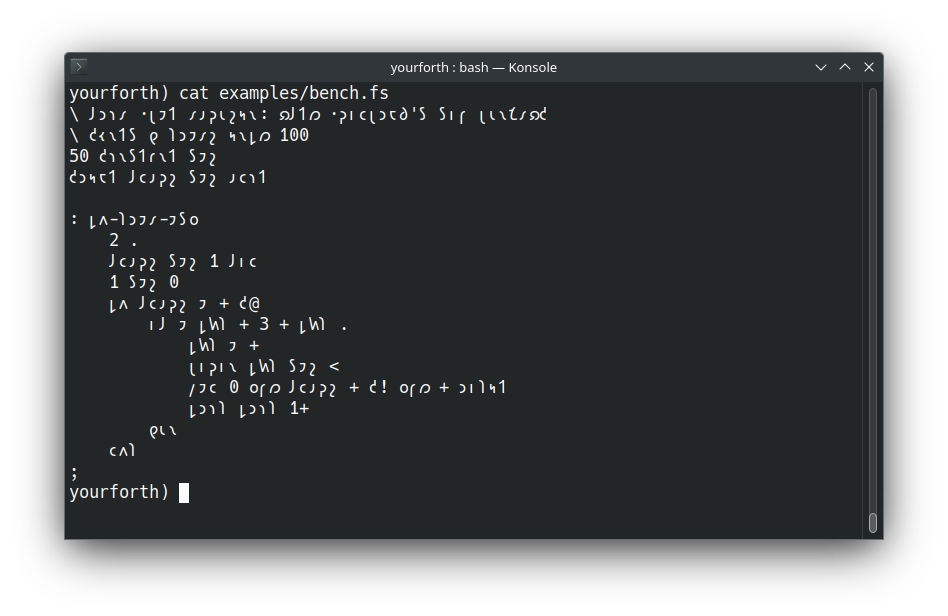
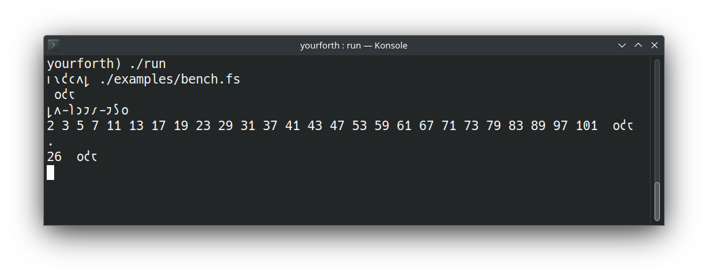

# README.md

A fork of Albert van der Horst's yourforth project converted to use the Shavian alphabet.

Note: this is a work in progress.

## Building yourforth

Install `fasm` (the flat assembler) and `rlwrap`.

For example, in Arch linux:
```
sudo pacman -S fasm
sudo pacman -S rlwrap
```

Then:
```
fasm yourforth.fas
```

## Running yourforth

```
./run
```

- Press `Enter` to see the 𐑴𐑒𐑱 prompt.
- Type 𐑢𐑻𐑛𐑟 `Enter` to see the list of supported words.

*rlwrap* is used to show previous commands while in *yourforth* (press `CursorUp`).

Only one example program has so far been converted to Shavian: `bench.fs`, which contains the definition of the word  `𐑛𐑵-𐑐𐑮𐑲𐑥-𐑲𐑕𐑴`. To add the word to the *yourforth* dictionary:
```
𐑦𐑯𐑒𐑤𐑵𐑛 ./examples/bench.fs
```
Then run the word:
```
𐑛𐑵-𐑐𐑮𐑲𐑥-𐑲𐑕𐑴
```
A list of prime numbers up to 101 should be displayed. The word `𐑛𐑵-𐑐𐑮𐑲𐑥-𐑲𐑕𐑴` puts the number of primes found on the stack. Remove the top value on the stack and display it using the word `.`:
```
.
```
The value 26 should be displayed.

## Screenshots

Running *yourforth* and executing the word `𐑢𐑻𐑛𐑟`:



The *bench.fs* example program:


Using *bench.fs*:

